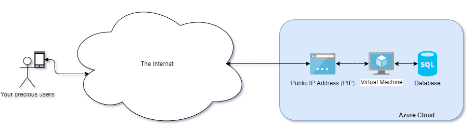

# cloud_architectures
A repository of cloud architectures for education and illistration purposes. Most of the examples will be based on Azure technoloties. This will continue to grow over time so keep an eye on this space for more.

---

1. [Basic IaaS Architecture](basic-iaas-architecture)

---

## 1. [Basic IaaS Architecture](basic-iaas-architecture)

This is an example architecture for the most basic Infrastructre as a service offerning in Azure. It's really here for illistration pupropses and I would really really not recommend this setup for a production system.

Pros
* Very simple setup
* Cheap option relative to other Paas Offering.

Cons
* Lots to manage yourself - ie updates of the vm and db
* No high avability - in the case of failure of the db or the vm there is no other hot system to take over the workload, thus your system is not available to your users.
* Azure will force at times updates of the VM - your site will be down.
* Does not scale - when you get more traffic than you can handle in the db or vm your appliation will fail.